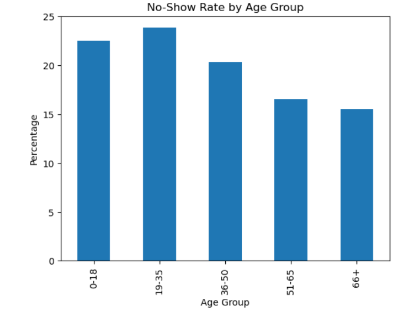

# Medical Appointment No-Show Analysis Using Python

## Project Overview

This project analyzes medical appointment attendance data to identify factors associated with patient no-shows.

The analysis explores demographic, medical, and social factors that may influence appointment attendance and healthcare engagement. The goal is to generate actionable insights that can help healthcare providers reduce missed appointments and improve patient outcomes.

---

## Dataset Information

The dataset contains approximately **110,527 medical appointments** and includes information about:

* Patient demographics
* Age
* Gender
* SMS reminders
* Scholarship status
* Hypertension
* Diabetes
* Alcoholism
* Appointment attendance outcomes

---

## Project Objectives

* Measure the overall no-show rate
* Analyze the impact of SMS reminders on attendance
* Investigate age-group differences
* Evaluate the effect of chronic diseases
* Examine the influence of scholarship status
* Generate actionable healthcare insights

---

## Tools Used

* Python
* Pandas
* Matplotlib
* Jupyter Notebook

---

## Data Cleaning

The following data quality checks were performed:

* Removed invalid age values
* Removed unrealistic age records (>100 years)
* Checked for missing values
* Checked for duplicate records
* Created age groups for analysis

---

## Exploratory Data Analysis (EDA)

The analysis focused on the following factors:

* Overall No-Show Distribution
* SMS Reminder vs No-Show
* Age Group vs No-Show
* Gender vs No-Show
* Diabetes vs No-Show
* Hypertension vs No-Show
* Scholarship vs No-Show

---

## Key Findings

### SMS Reminders

Patients who received SMS reminders showed a higher no-show rate compared to patients who did not receive reminders.

### Age Groups

Patients aged **19–35 years** demonstrated the highest no-show rates, indicating younger adults may require additional engagement strategies.

### Gender

Only a small difference was observed between male and female patients.

### Diabetes

Patients with diabetes demonstrated slightly better appointment attendance.

### Hypertension

Patients with hypertension demonstrated slightly better appointment attendance.

### Scholarship

Patients receiving scholarships showed a higher no-show rate compared to patients without scholarships.

---

## Visualizations

### SMS Reminder vs No-Show

### Age Group vs No-Show

### Diabetes vs No-Show

### Hypertension vs No-Show

### Scholarship vs No-Show

---

## Business Recommendations

Based on the analysis, healthcare providers should consider:

* Developing targeted reminder strategies for younger patients.
* Investigating why SMS reminders are associated with higher no-show rates.
* Providing additional support for high-risk patient groups.
* Improving patient engagement and appointment follow-up processes.

---

## Repository Structure

* README.md
* Medical_Appointment_No_Show_Analysis.ipynb
* Visualization Images (.png)

---

## Author

**Mass Ghazawi**

Medical Graduate | Healthcare Data Analyst

GitHub: https://github.com/DrMassAnalytics
